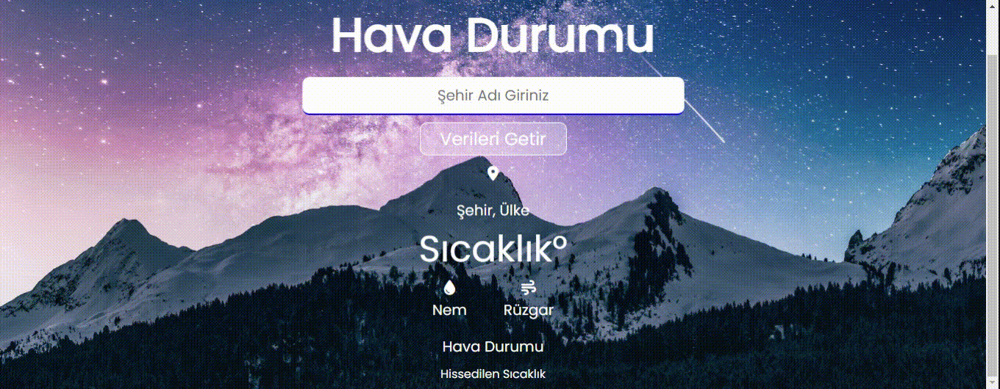

# JSWeather

-Html ve Css ile sayfa tasarımı yapıldı

-Js ile elementler main.js ye alındı.

-openweathermap.org sitesinden fetch ile hava durumu bilgisi API ile alındı ve ekrana yazdırıldı.

# JSHavaDurumu
